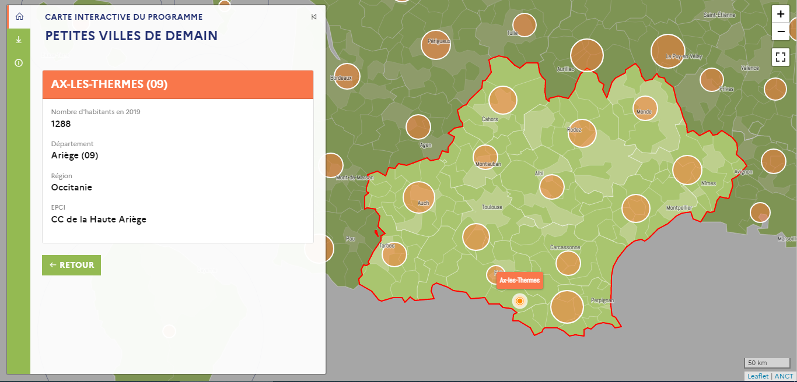

# Carte interactive des communes bénéficiaires du programme Petites villes de demain (PVD)

[Page officielle](https://petitesvillesdedemain.anct.gouv.fr)
[Lien direct vers la carte](https://anct-carto.github.io/pvd)

## Fonctionnalités 
- Rechercher, localiser et accéder aux propriétés de chaque commune Petite ville de demain : population, EPCI de rattachement ; 
- Afficher le nombre et la liste des communes Petites villes de demain par région et département ;  

## Données
La liste des communes bénéficiaires est disponible sous Licence Ouverte 2.0 sur [data.gouv.fr](https://www.data.gouv.fr/fr/datasets/programme-petites-villes-de-demain/).

## Technologies
Cet outil, conçu et développé par le service cartographie de l'ANCT, a été réalisé en HTML/CSS/Javascript et utilise les librairies Vue 2.7, Leaflet 1.0.7 et l'extension communautaire Leaflet Sidebar, Bootstrap 5.1.3, Papaparse, Line awesome. Le fond cartographique est issu des fichiers Admin Express de l'IGN ; il a été généralisé par le service cartographie pour un usage web. 

## Pour en savoir plus sur le programme 
Sur le site de l'ANCT : [petitesvillesdedemain.anct.gouv.fr](https://petitesvillesdedemain.anct.gouv.fr)
